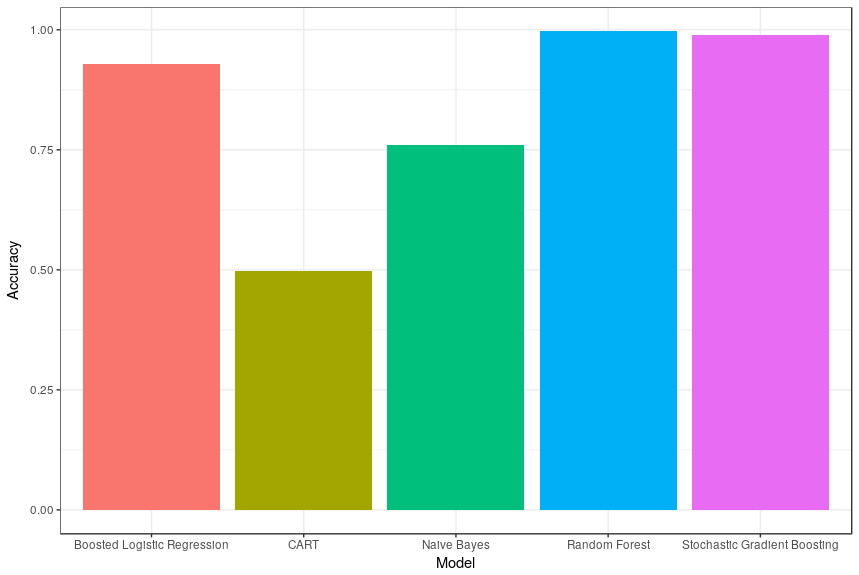

```{r setup, include=FALSE}
knitr::opts_chunk$set(echo = TRUE)
```


---

### Dataset background
> It is now possible to capture a vast volume of personal activity data reasonably cheaply using products like Jawbone Up, Nike FuelBand, and Fitbit. These kinds of instruments are part of the quantified self-movement, a group of fans who frequently take measurements of themselves to better their wellbeing, to discover trends in their behaviour, or because they are computer geeks. 

---

### Assignment instructions
> One thing people do on a daily basis is measure how much of a given task they do, but how good they do it is rarely quantified. Your purpose in this project would be to use data from accelerometers of 6 participants on the belt, wrist, shoulder, and dumbell.
> Your project 's aim is to anticipate the direction in which they did the exercise. In the training package, this is the 'class' component. You can use all of the other factors you can use to forecast. You should build a report that explains how you designed your model, how you used cross validation, what you thought the sample error is supposed to be, and why you made the choices you made. In order to forecast 20 different test cases, you can also use your prediction model.
---

### Excercise development
#### Setting up R
```{r, eval = F}
library(caret)
library(parallel)
library(foreach)
library(doParallel)
set.seed(62094)
```

---

#### Loading data
```{r, eval = F}
dataset <- read.csv("https://d396qusza40orc.cloudfront.net/predmachlearn/pml-training.csv")
dim(dataset)
```
```
## [1] 19622   160
```
The data has 19,622 observations of 160 variables.

---

#### Partitioning data sets
```{r, eval = F}
inTrain <- createDataPartition(y = dataset$classe,
                               p = 0.7,
                               list = F)
training <- dataset[inTrain, ]; testing <- dataset[-inTrain, ]
```
Using 70% of the data for the training set and 30% for the test set.

```{r, eval = F}
dim(training); dim(testing)
```
```
## [1] 13737   160
## [1] 5885  160
```

---

#### Cleaning the data
```{r, eval = F}
training <- training[ , colSums(is.na(training)) == 0] # selecting only columns that do not have NAs
testing <- testing[ , colSums(is.na(testing)) == 0]
training <- training[, -nearZeroVar(training)] # removing columns with near zero variance
testing <- testing[, -nearZeroVar(testing)]
training <- training[ , -c(1:5)] # removing variables for row number, username, and timestamp
testing <- testing[ , -c(1:5)]
```
Variables have been reduced:
```{r, eval = F}
dim(training); dim(testing)
```
```
## [1] 13737    54
## [1] 5885   54
```

---

#### Training models
##### Setting up parallel processing
Will use 3 out of 4 CPU cores
```{r, eval = F}
cl <- makeCluster(detectCores() - 1)
registerDoParallel(cl, cores = detectCores() -1)
```

---

##### TrainControl
Setting train control arguments with 4-fold cross-validation to enable parallel processing
```{r, eval = F}
tr.ctrl <- trainControl(method = "cv",
                        number = 4,
                        allowParallel = TRUE,
                        verboseIter = TRUE)
```

---

##### Fitting with different models
Different models used below: Naive Bayes, Boosted Logistic Regression, Stochastic Gradient Boosting, CART, and Random Forest.
At least one of these, particularly the random forest model, is expected to perform with an accuracy of > 95%.
##### Naive Bayes
```{r, eval = F}
modFit.nb <- train(classe ~ .,
                   data = training,
                   method = "nb",
                   trControl = tr.ctrl)
saveRDS(modFit.nb, "modfit.nb.rds") # saving the model to a file
pred.nb <- predict(modFit.nb, testing)
acc.nb <- confusionMatrix(pred.nb, testing$classe)$overall['Accuracy']
acc.nb
```
```
## Accuracy 
## 0.7607477 
```

---

##### Boosted Logistic Regression
```{r, eval = F}
modFit.logbst <- train(classe ~ .,
                       data = training,
                       method = "LogitBoost",
                       trControl = tr.ctrl)
saveRDS(modFit.logbst, "modfit.logbst.rds") # saving the model to a file
pred.logbst <- predict(modFit.logbst, testing)
acc.logbst <- confusionMatrix(pred.logbst, testing$classe)$overall['Accuracy']
acc.logbst
```
```
# Accuracy 
# 0.928681 
```

---

##### Stochastic Gradient Boosting
```{r, eval = F}
  modFit.gbm <- train(classe ~ .,
                     data = training,
                     method = "gbm",
                     trControl = tr.ctrl)
saveRDS(modFit.gbm, "modfit.gbm.rds")  # saving the model to a file
pred.gbm <- predict(modFit.gbm, testing)
acc.gbm <- confusionMatrix(pred.gbm, testing$classe)$overall['Accuracy']
acc.gbm
```
```
# Accuracy 
# 0.9882753 
```

---

##### CART
```{r, eval = F}
modFit.rpart <- train(classe ~ .,
              data = training,
              method = "rpart",
              trControl = tr.ctrl)
saveRDS(modFit.rpart, "modfit.rpart.rds") # saving the model to a file
pred.rpart <- predict(modFit.rpart, testing)
acc.rpart <- confusionMatrix(pred.rpart, testing$classe)$overall['Accuracy']
acc.rpart
```
```
## Accuracy 
## 0.4971963 
```

---

##### Random Forest
```{r, eval = F}
  modFit.rf <- train(classe ~ .,
                     data = training,
                     method = "rf",
                     trControl = tr.ctrl)
saveRDS(modFit.rf, "modfit.rf.rds") # saving the model to a file
pred.rf <- predict(modFit.rf, testing)
acc.rf <- confusionMatrix(pred.rf, testing$classe)$overall['Accuracy']
acc.rf
```
```
# Accuracy 
# 0.9969414 
```

---

#### Stopping the cluster
```{r, eval = F}
stopCluster(cl)
```

---

### Visualising model performances
```{r, eval = F}
acc.values <- c(acc.nb, acc.logbst, acc.gbm, acc.rpart, acc.rf)
mod.names <- c("Naive Bayes", "Boosted Logistic Regression", "Stochastic Gradient Boosting", "CART", "Random Forest")
x <- data.frame(Model = mod.names,
                Accuracy = acc.values)
ggplot(x, aes(x = Model, y = Accuracy)) + 
  geom_bar(stat = "identity", aes(fill = Model)) +
  theme_bw() + theme(legend.position = "none")
```


The highest performing model is Random Forest, followed by Stochastic Gradient Boosting.
For the last part of the task, they can use the Random Forest model.

---

### Prediction on new dataset
Applying the Random Forest model to a different dataset
```{r, eval = F}
test.part2 <- read.csv("https://d396qusza40orc.cloudfront.net/predmachlearn/pml-testing.csv")
dim(test.part2)
```
```
## [1]  20 160
```
```{r, eval = F}
predVal <- predict(modFit.rf, test.part2)
```
```
## [1] B A B A A E D B A A B C B A E E A B B B
## Levels: A B C D E
```